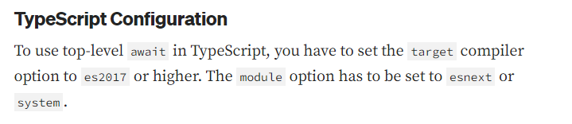

Errors I faced and things I learned: 

- [How to take input in TS?](https://stackoverflow.com/questions/33858763/console-input-in-typescript)

> use of readline and process module 

- importing npm modules in TS.

---

#### TOP LEVEL AWAIT => using type "module" in package.json

**Top level await prerequisites in TypeScript**

1. "type" : "module" in package.json 

> Top-level 'await' expressions are only allowed when the 'module' option is set to 'es2022', 'esnext', 'system', 'node16', or 
'nodenext', and the 'target' option is set to 'es2017' or higher.

2. This is the error i got while adding top level await to my TS project, and this is second prerequisite.

3. Final requirements is in this particular project, that I need to use *readline/promises* version of the installed npm package.

```

import * as readline from "readline/promises";

```

   👉 [Solution I seeked](https://betterprogramming.pub/typescripts-new-top-level-await-cc6beadbde8)

   

 ---
   

   ##### TSCONFIG.JSON

- So, i came to know that there is this, tsconfig.json file, which helps in compiling my typescript code. (😲😲, interesting)

> tsc => By default, creates **tsconfig.json** in the current working directory

---

##### COMMAND TO CREATE & VIEW TSCONFIG FILE IN MY CURRENT DIRECTORY

```JavaScript

tsc --init  // create tsconfig file (default tsconfig template, tsc generates)
tsc --showConfig //show tsconfig file 

// changing the module and target configuration 
tsc --target es2017 --module es2022 ques4.ts

```


